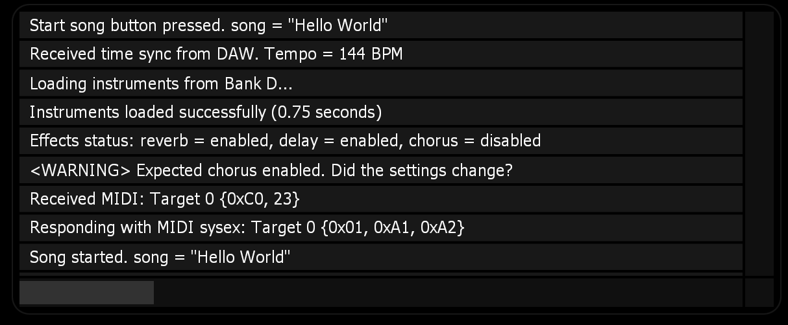

# MKConsole for Lemur

Log helpful debug messages in your Lemur project. 

## Installation

1. Click the green "Code" button at the top of this page and download the zip files.
2. Drag and drop **MKConsole.jzlib** into one of your Lemur projects to start using it right away.
3. You can also double-click the **MKConsole Demo.jzml** file to see a demo of how it works.

